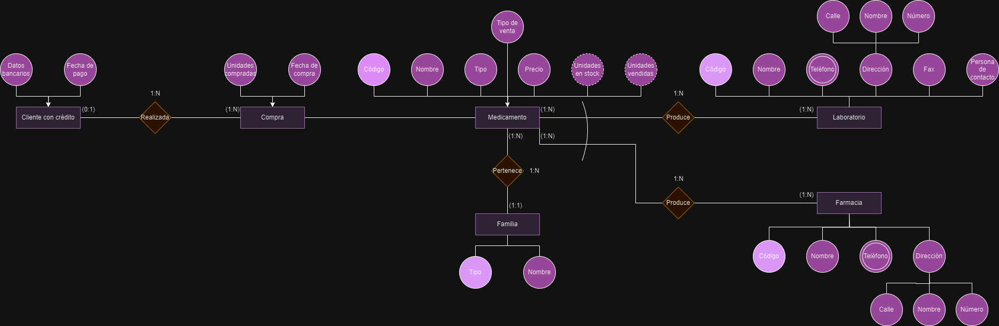

# **Práctica 1 Administración y diseño de base de datos**

## **Introducción**

En esta práctica realizamos un modelo entidad/relacion de una base de datos de una farmacia.

## **Entidades y atributos**

Las distintas entidades que se pueden encontrar en el diseño son las siguientes:

- Medicamento.
- Laboratorio.
- Farmacia.
- Familia.
- Compra.
- Cliente con crédito.

### **Medicamento**

  Esta entidad representa los medicamentos que se pueden encontrar en la farmacia. Cada medicamento tiene los siguientes atributos: 
  
  - <u>Código</u>: atributo identificador del medicamento, contiene un número único para cada medicamento. Un ejemplo de un valor que podria tomar este atributo es 494173295371. 

  - <u>Nombre</u>: atributo descriptor el cual toma como valor el nombre del medicamento. Un ejemplo de un valor que podria tomar este atributo es "Ibuprofeno".

  - <u>Tipo</u>: atributo descriptor que indica el tipo de medicamento que es, algunos ejemplos de valores que podria tomar este atributo son "Jarabe", "Comprimido", "Pomada", etc.

  - <u>Tipo de venta</u>: atributo descriptor que indica si el medicamento se vende con receta o sin receta. Los valores que podría tomar este atributo son "Con receta" o "Sin receta".

  - <u>Precio</u>: atributo numérico que indica el precio del medicamento. Un ejemplo de un valor que podria tomar este atributo es 5.50€.

  - <u>Unidades en stock</u>: atributo calculado que indica el número de unidades que hay en stock de ese medicamento. Para conocer su valor se debe restar el número de unidades vendidas al número de unidades compradas. Un ejemplo de un valor que podria tomar este atributo es 100.

  - <u>Unidades vendidas</u>: atributo calculado que indica el número de unidades vendidas de ese medicamento. Para conocer su valor se debe sumas las unidades vendidas de cada compra. Un ejemplo de un valor que podria tomar este atributo es 50.

### **Laboratorio**

  Esta entidad representa los laboratorios que producen los medicamentos. Cada laboratorio tiene los siguientes atributos:

  - <u>Código</u>: atributo identificador del laboratorio, contiene un número único para cada laboratorio. Un ejemplo de un valor que podria tomar este atributo es LAB611789245.

  - <u>Nombre</u>: atributo descriptor que contiene el nombre del laboratorio. Un ejemplo de un valor que podria tomar este atributo es "Pfizer".

  - <u>Teléfono</u>: atributo multievaluado que contiene el número de teléfono del laboratorio. Cabe destacar que un laboratorio puede tener varios números de teléfono. Un ejemplo de un valor que podria tomar este atributo es 922654321.

  - <u>Dirección</u>: atributo compuesto que contiene la dirección del laboratorio. Este está compuesto por la calle, el nombre y el número. Un ejemplo de un valor que podria tomar este atributo es "Calle de la salud, 5".

  - <u>Fax</u>: atributo descriptor que contiene el número de fax del laboratorio. Un ejemplo de un valor que podria tomar este atributo es 922654322.

  - <u>Persona de contacto</u>: atributo descriptor que contiene el nombre de la persona de contacto del laboratorio. Un ejemplo de un valor que podria tomar este atributo es "Juan Pérez".

### **Farmacia**

  Esta entidad representa las farmacias que venden/producen los medicamentos. Cada farmacia tiene los siguientes atributos:

  - <u>Código</u>: atributo identificador de la farmacia, contiene un número único para cada farmacia. Un ejemplo de un valor que podria tomar este atributo es FAR611789245.

  - <u>Nombre</u>: atributo descriptor que contiene el nombre de la farmacia. Un ejemplo de un valor que podria tomar este atributo es "Farmacia de la salud".

  - <u>Teléfono</u>: atributo multievaluado que contiene el número de teléfono de la farmacia. Al igual que con el laboratorio, una farmacia puede tener varios números de teléfono. Un ejemplo de un valor que podria tomar este atributo es 922881254.

  - <u>Dirección</u>: atributo compuesto que contiene la dirección de la farmacia. Este está compuesto por la calle, el nombre y el número. Un ejemplo de un valor que podria tomar este atributo es "Calle de la salud, 5".

### **Familia**

  Esta entidad representa las familias de medicamentos. Cada familia tiene los siguientes atributos:

  - <u>Tipo</u>: atributo identificador de la familia, contiene el tipo de enfermedad para la que estan destinsados los medicamentos de esa familia. Un ejemplo de un valor que podria tomar este atributo es "Gastroenteritis".

  - <u>Nombre</u>: atributo descriptor que contiene el nombre de la familia. Un ejemplo de un valor que podria tomar este atributo es "Medicamentos para la gastroenteritis".

### **Compra**

  Esta entidad representa las compras de medicamentos que realiza un cliente. Cada compra tiene los siguientes atributos:

  - <u>Unidades compradas</u>: atributo descriptor que indica el número de unidades compradas de un medicamento. Un ejemplo de un valor que podria tomar este atributo es 5.

  - <u>Fecha de compra</u>: atributo descriptor que indica la fecha en la que se realizó la compra. Un ejemplo de un valor que podria tomar este atributo es 05/07/2024.

### **Cliente con crédito**

Esta entidad representa los clientes que tienen crédito en la farmacia. Cada cliente tiene los siguientes atributos:

  - <u>Número de seguridad social</u>: atributo identificador del cliente, contiene el número de seguridad social del mismo. Un ejemplo de un valor que podria tomar este atributo es 345679123456.

  - <u>Datos bancarios</u>: atributo descriptor que contiene los datos bancarios del cliente. Un ejemplo de un valor que podria tomar este atributo es "ES1234567891234567891234".

  - <u>Fecha de pago</u>: atributo descriptor que indica la fecha en la que se realiza el pago de todos los medicamentos sacados a crédito. Un ejemplo de un valor que podria tomar este atributo es 31/10/2024.

## **Relaciones**

Las distintas relaciones que se pueden encontrar en el diseño son las siguientes:

### **Relación Medicamento - Laboratorio y Medicamento - Farmacia**

  Estas relaciones son un tanto especiales puesto que existe una restricción de exclusividad entre ellas. Esto quiere decir que un medicamento solo puede ser producido por un laboratorio o por una farmacia pero nunca por ambos. Es decir, si un medicamento es comprado a un laboratorio, este no puede ser producido por la propia farmacia y si es producido por la farmacia este no puede ser comprado a un laboratorio.

  En cuanto a la cardinalidad de las relaciones se puede decir que un laboratorio puede producir uno o varios medicamentos y un medicamento puede ser producido por uno o varios laboratorios. Por otro lado, una farmacia puede producir uno o varios medicamentos y un medicamento puede ser producido por una o varias farmacias.

### **Relación Medicamento - Familia**

  Con esta relación mostramos que los medicamentos pueden pertenecer a familias, esto es útil puesto que en caso de que no hayan existencias de un medicamento en especifico se puede ofrecer al cliente un medicamento de la misma familia.

  En cuanto a la cardinalidad de la relación se puede decir que una familia esta formada por 1 o varios medicamentos y un medicamento pertenece a una única familia.

### **Relación Compra - Cliente con crédito**

  Esta relación es unicamente entre compra y cliente con crédito puesto que aquellos clientes que no tienen crédito no almacenamos ningún dato de ellos, en cambio de los clientes con crédito almacenamos su número de seguridad social, sus datos bancarios y la fecha de pago.

  En cuanto a la cardinalidad de la relación se puede decir que una compra puede ser realizada por 0 o 1 cliente con crédito, es decir, que el cliente que realice la compra puede o no tener crédito. Por otro lado, un cliente con crédito puede realizar 1 o varias compras, es decir, puede realizar varias compras a crédito.